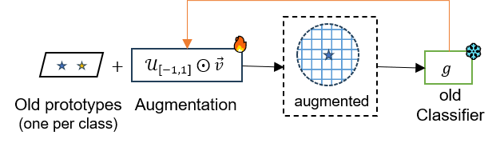
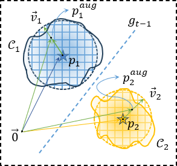
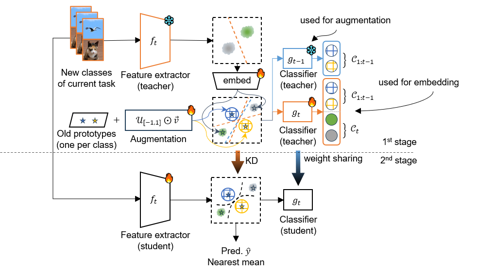

# Class-Incremental Learning with Multi-Teacher Knowledge Distillation

<center>


</center>

---
<center>

</center>

**Soft computing lab**
---

<strong> Implementation for Class-Incremental Learning with Multi-Teacher Knowledge Distillation </strong>

Abstract

- [Installation](#installation)
- [Run](#run-experiment)
- [Results](#results)


### Installation
**Dependencies**
* Python 3.8
* torch 1.8.1
* torchvision 0.6.0
* tqdm
* numpy
* scipy
* quadprog
* POT


### Run
```
python main.py --config ./exps/ours.json
```
******
