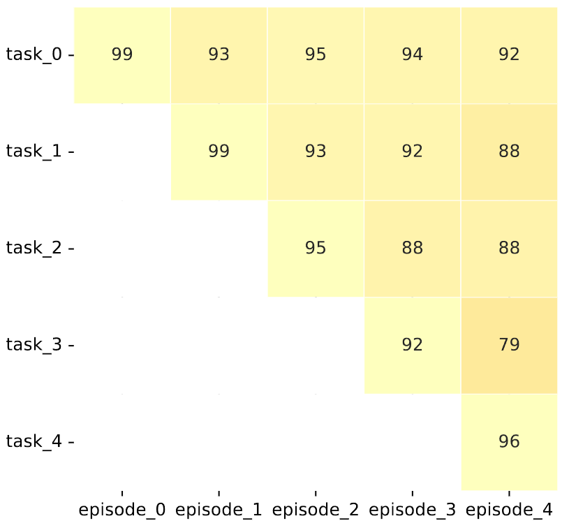
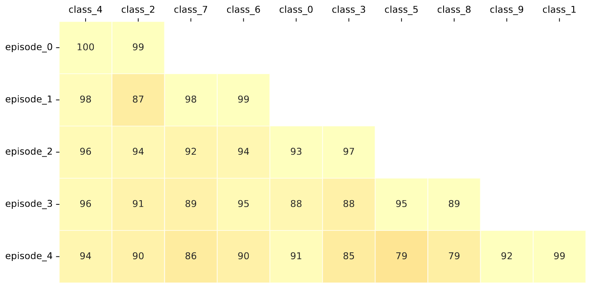

# Class-Incremental Learning with Knowledge Distillation
**Soft computing lab**
Implementation for Continual learning via Knowledge Distillation


****
- [Run](#run-experiment)
- [Installation](#installation)
- [Results](#results)


### Installation
---
**Dependencies**
* Python 3.8
* torch 1.8.1
* torchvision 0.6.0
* tqdm
* numpy
* scipy
* quadprog
* POT


### Run
---
```
python main.py --config ./exps/ours.json
```
******

### Results
---
**MNIST-5tasks**
<center>
 <br> Average accuracy
</center>

|||
|:---:|:---:|
|Test accuracy|Class accuracy|